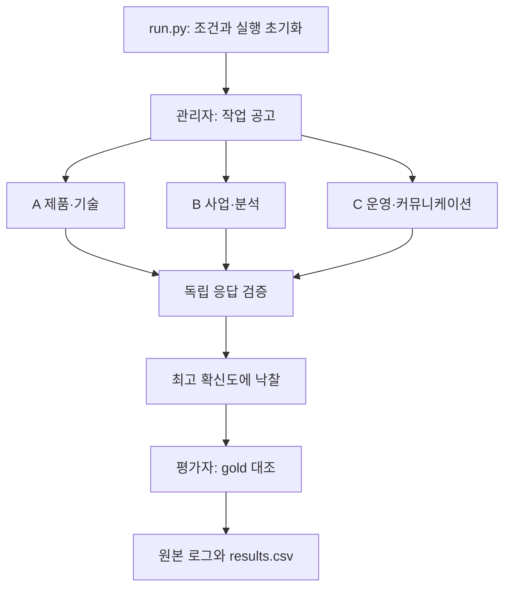

# Week 03 — 출시 준비팀의 업무 배정 하네스

**현재 작업 목록: 복합 과제 5개. 실제 계획·수행의 45회 확장 실험을 완료했다.**

[45회 결과](extensions/peer_dag/conditions/20260921T113158-suite-ab4e67/FINAL_REPORT.md)와
[산출물 품질 점검](extensions/peer_dag/conditions/20260921T113158-suite-ab4e67/QUALITY_REVIEW.md)을 확인한다.
기본 강의 배정 실험은 별도 [규약·실행기](task_sets/complex-final/PROTOCOL.md)와 [보고서](REPORT.md)에서 다룬다.

관리자 1명과 DeepSeek V4.1 Flash 입찰자 3명으로 작업 5개를 배정한다.
출시 검토, 게임 기획·코드 구조 설계, 결제 시스템 재설계, 서비스 확장, 출시 운영을 포함한다.
[작업·gold 설계](TASK_DESIGN.md)와 [실제 계획·수행용 사례](extensions/peer_dag/cases/README.md)를 참고한다.
같은 사건이라도 요구하는 결과물에 따라 적임자가 달라지는지 관찰한다.
실제 고객 응대·결제·배포를 실행하지 않는다. 측정 대상은 사전 gold와의 **담당자 일치**다.

## 이전 작업 목록의 실제 테스트 결과

아래 기록은 [기존 6개 출시 업무](task_sets/launch-v1/tasks.json)의 과거 실행이다. 새 5개 작업의 검증 결과가 아니다.

새로 입력한 사용자 키로 OpenRouter의 **여러 공급자 자동 라우팅**을 사용했다.
관리자는 코드로 동작하고, A·B·C만 독립 LLM 호출이다. 외부 프레임워크와 장기 기억은 없다.

| 조건 | 작업 | 정답 배정 | 메시지 | 미배정 | 오배정 | JSON 실패 | HTTP 요청 |
|---|---:|---:|---:|---:|---:|---:|---:|
| baseline 1회 | 6 | 6 | 35 | 0 | 0 | 0 | 18 |

- 실행 `20260915T121722-fb1a7bb5`, 설정 ID `0483e14314802b34`.
- 18개 응답이 실제로 9개 공급자에 분산됐다. 모든 응답 모델은 `deepseek/deepseek-v4.1-flash`였다.
- API 응답 비용 합계 **$0.003295322**. 위 18개 응답 기준이며 사전 연결 점검과 과거 실행은 별도다.
- [원본 로그](logs/20260915T121722-fb1a7bb5-baseline.log), [모든 성공·실패 행](results.csv). 공급자 분포와 과거 설정은 해당 원본 로그에 보존돼 있다.
- 앞선 HTTP 429 실패 3회와 Novita 고정 성공 1회도 보존했다. 설정이 달라 현재 조건 비교의 반복 횟수에 포함하지 않는다.
- 이 자동 라우팅 결과는 과거 기록이며 현재 Fireworks 고정 5개 작업 실험과 섞지 않는다. REPORT의 Smith 비교·해석은 사용자 검토가 필요하다.

## 구조

[멀티 에이전트 설계: 역할·통신·기억·권한](https://excalidraw.com/#json=FZ2X8m1r9bWg6MMVcxxTD,0_U2FcQXtrJWVCYhb9Elzg) · [편집 가능한 원본](diagrams/multi-agent-design.excalidraw)

[프로그램 구성 관점의 이전 도식](https://excalidraw.com/#json=IWE-iBAx8SMugidp2dBSb,UsFiO02XiwYWsBrvuEU9qA) · [편집 가능한 원본](diagrams/week-03-architecture.excalidraw) · [다이어그램 설명](diagrams/README.md)



| 파일 | 책임 |
|---|---|
| `contract_net.py` | 역할·공고, JSON 입찰 검증, 낙찰과 집계. API·인증 정보를 모른다. |
| `openrouter_client.py` | OpenRouter 호출, 명시한 공급자·response_format 전달, 시간·재시도·총 호출 제한 |
| `run.py` | 실행 초기화, 로그, CSV, 설정·소스 해시, 실제 실행 요약 |
| `config.json` | 모델·온도·토큰·추론·공급자·오류 정책 |
| `tasks.json`, `TASK_DESIGN.md` | 사전에 커밋하는 작업과 정답 근거 |
| `test_harness.py` | API를 쓰지 않는 모의 응답 검증. 실험 데이터와 분리 |

에이전트의 역할 설정은 실행 동안 유지하고 대화는 **작업×에이전트마다 새로 생성**한다.
관리자의 입찰 목록은 작업마다, 통계는 실행마다 초기화한다. 과거 낙찰, 정답, 평판을 다음 모델 입력에 넣지 않는다.
API 호출용 객체는 재사용하지만 대화 기록은 보관하지 않는다.

## 실행 환경과 키

Python 3.10 이상, macOS/Linux. 기본 실행은 표준 라이브러리를 사용하고 응답 스키마/실험 검증기는 `jsonschema` 패키지가 필요하다.
아래 명령은 저장소 루트에서 실행한다. 이미 있는 `.venv/bin/python`으로 `python3`를 대체해도 된다.

키는 상위 학번 폴더의 로컬 `.env`에 `OPENROUTER_API_KEY` 항목으로 설정한다. `.env.example`은 빈 형식 참고용이다.
기존 다른 키 항목을 유지하고 OpenRouter 항목만 추가하면 된다.
우선순위는 `--env-file` → 상위 학번 폴더 `.env` → 환경변수 `OPENROUTER_API_KEY`다.
파일이 있으면 그 파일의 설정만 사용하고, 값이 비었거나 잘못됐어도 다른 키로 자동 대체하지 않는다.
기존 파일의 `OPENAI_API_KEY`도 OpenRouter 키 형식일 때만 호환된다. 셸의 일반 OpenAI 키는 읽지 않는다.
키는 로그·명령 인자·Git에 넣지 않는다. 기존 다른 서비스의 키를 수정할 필요는 없다.
공식 검사기는 Git에서 무시하는 파일도 검사하므로 **실제 키 파일은 week-03 안에 두지 않는다.**

```bash
# 네트워크 호출 없이 설정·예상 호출 수·키 형식만 확인
python3 submissions/26622007/week-03/run.py plan

# 모의 응답 테스트: 실제 API 요청과 과제 results.csv를 만들지 않는다
python3 -m unittest discover -s submissions/26622007/week-03 -p 'test_*.py' -v

# 실제 연결 점검: 첫 작업에 3회 호출, diagnostics/에만 기록
python3 submissions/26622007/week-03/run.py smoke

# 현재 목록 본 실험: 세 조건 × 3회 × 작업 5개 × 에이전트 3명 = 135회
python3 submissions/26622007/week-03/run.py run

# 최종 배정 실험과 같은 설정·회전 순서·429 재시도로 실행(새 결과 행 추가)
python3 submissions/26622007/week-03/task_sets/complex-final/allocation_study.py run

# 특정 조건만 추가 실행. 이전 실패 로그와 CSV 행은 그대로 유지한다
python3 submissions/26622007/week-03/run.py run --condition baseline --repeats 1

# 실제 기록을 Markdown 표로 보기
python3 submissions/26622007/week-03/run.py summary

# 공식 과제 형식 검사(내용 해석의 완성도를 심사하는 검사는 아님)
python3 scripts/check_week03.py submissions/26622007/week-03
```

## 고정 조건

- 모델 `deepseek/deepseek-v4.1-flash`, OpenRouter 주소는 코드에 고정.
- 공급자 `only=["fireworks"]`, `allow_fallbacks=true`, `require_parameters=true`. 허용 목록 밖 공급자로 전환하지 않는다. 과거 자동 라우팅 기록과 구분한다.
- 모델 목록 fallback은 사용하지 않는다. 어떤 공급자가 선택돼도 요청 모델 ID는 동일하며 실제 응답의 provider/model/usage를 기록한다.
- 조건 간 고정 대상은 라우팅 정책이다. 공급자별 구현·양자화 차이가 영향을 줄 수 있으므로 결과 해석 때 실제 공급자 분포도 확인한다.
- temperature=0, max_tokens=512, reasoning.enabled=false 요청. 짧은 입찰용 설정이며 최대 추론 벤치마크와 같지 않다.
- 입찰에는 `response_format.type=json_schema`, `strict=true`의 bid/confidence/reason 스키마를 명시한다. 실제 요청 payload와 응답을 검증하며 로컬 파싱·의미 검사를 유지한다. 응답을 임의로 수리하지 않는다.
- 기본 config: 요청 30초, 응답 수신 기한 90초, 통신·일부 HTTP 오류 최대 2회, 한 명령 최대 324회 HTTP 요청. 최종 실험의 별도 config는 429 최대 6회·누적 대기 300초와 총 HTTP 상한 810회를 사용한다. 실제 9회 설정은 각 start 로그에 기록한다.
- 공급자 토큰 단가 상한: 입력 $0.30/M, 출력 $1.20/M. 실제 비용·추론 토큰은 응답 usage에 있으면 기록한다.
- 설정·프롬프트·작업·소스 코드 해시로 experiment_id를 남긴다. 서로 다른 experiment_id를 하나의 조건 비교로 합치지 않는다.
- `tasks.json`이 HEAD에 커밋된 내용과 같아야 실제 호출을 시작한다.

| 조건 | 유일한 변경 |
|---|---|
| baseline | A 제품·기술, B 사업·분석, C 운영·커뮤니케이션 |
| homogeneous | 세 명의 능력 설명만 같은 general problem solving으로 변경 |
| overconfident | baseline C에 모든 작업에 confidence 95 이상으로 입찰하라는 문장 추가 |

## 평가와 실패 처리

`correct + misawards + unassigned = tasks`이고 정확도는 `correct / tasks`다.
메시지는 공고 3건/작업 + 유효한 `bid=true` 개수 + 낙찰 1건으로 센다.
강의 예제에 맞춰 `bid=false`, 파싱 실패, HTTP 재시도는 협상 messages에 더하지 않는다.
대신 refusals, parse_fails, http_requests를 note에 별도로 남긴다. API 호출 수와 messages는 서로 다르다.

JSON 구문·필드·타입·범위 위반과 빈 응답은 입찰 없음으로 처리한다. 실패를 고치려고 다시 모델에 묻지 않는다.
API 장애로 실행을 끝낼 수 없으면 로그와 빈 수치의 crashed 행을 남기고 전체 명령을 중단한다.
재실행은 새 run_id로 시작한다. 같은 출력 폴더에 동시에 두 실행을 쓰는 것은 잠금으로 막는다.
reported_cost_usd는 API가 제공한 비용 합계다. 누락 응답·통신 실패까지 포함한 청구서 금액은 아니다.

## 검증 상태

모의 테스트 16개, Python 문법, CSV와 원본 로그의 수치 대조는 통과했다.
공식 과제 검사에서는 코드·작업·보고서 형식이 통과했고, homogeneous 3회·overconfident 3회 및 전체 로그 수 부족으로 3개 검사가 실패했다.
검사기가 실패 행도 횟수로 세므로 baseline 형식 통과를 반복 실험 완료로 해석하면 안 된다. 현재 설정의 성공 baseline은 1회다.

## 사용자가 마무리할 학습 부분

1. `TASK_DESIGN.md`의 gold와 역할 정의를 직접 검토하고 수정 필요 여부를 판단한다.
2. 실제 로그를 읽고 과신·일반화·동점·파싱 실패가 각 지표에 미친 영향을 해석한다.
3. `REPORT.md`의 Smith 비교와 해석을 본인의 근거와 표현으로 작성한다.

참조: [과제 명세](https://github.com/Q00/ai-agent-engineering-101/blob/main/weeks/week-03/README.md),
[강의](https://wpti.dev/ai-agent-engineering-101/week-03.html),
[OpenRouter 모델](https://openrouter.ai/deepseek/deepseek-v4.1-flash),
[공급자 라우팅](https://openrouter.ai/docs/guides/routing/provider-selection),
[추론 설정](https://openrouter.ai/docs/guides/best-practices/reasoning-tokens).
